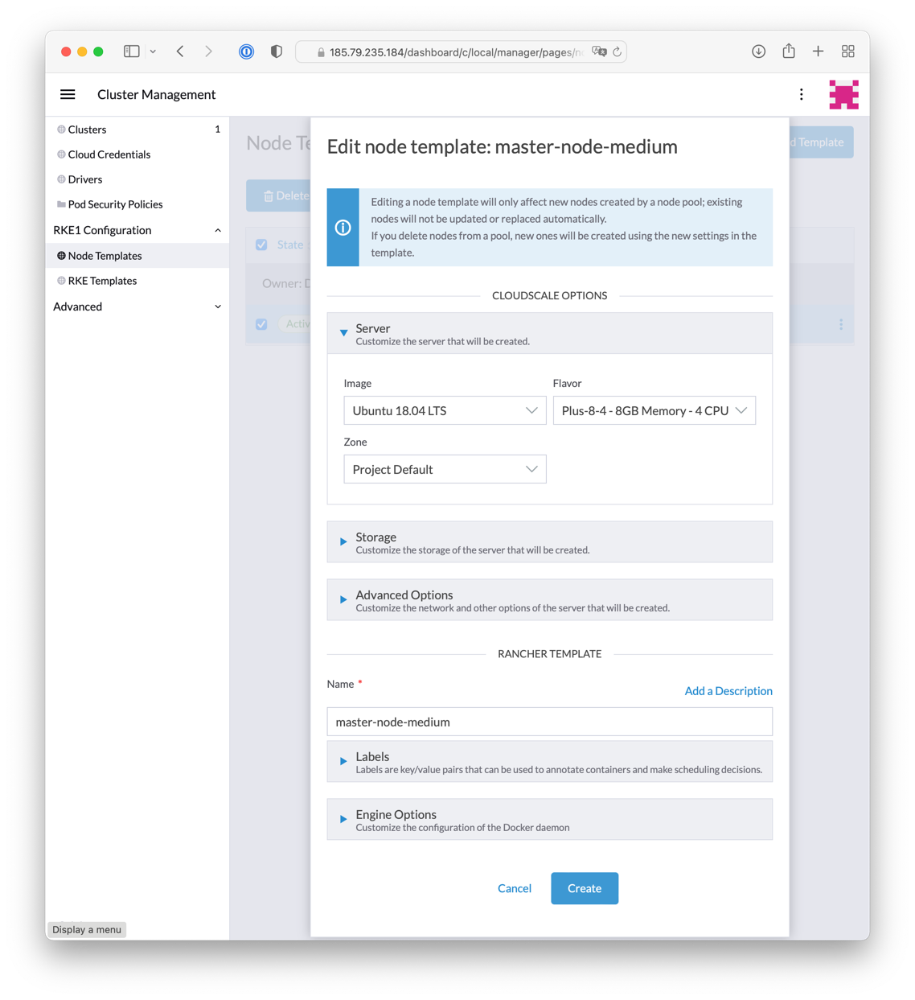

# Rancher 2 cloudscale.ch UI Driver

Rancher 2 UI driver for the [cloudscale.ch](https://www.cloudscale.ch) IaaS platform.

## Using the cloudscale.ch UI Driver

See the Rancher Documentation on [how to add a node driver](https://rancher.com/docs/rancher/v2.x/en/admin-settings/drivers/node-drivers/) to your installation. The relevant part is in 'Adding Custom Node Drivers':

1. From the Global view, choose Tools > Drivers in the navigation bar. From the Drivers page, select the Node Drivers tab. In version prior to v2.2.0, you can select Node Drivers directly in the navigation bar.
1. Click Add Node Driver.
1. Complete the Add Node Driver form. Then click Create:

    | Key               | Value |
    | ----------------- | ----- |
    | Download URL      | `https://github.com/cloudscale-ch/docker-machine-driver-cloudscale/releases/download/v1.2.0/docker-machine-driver-cloudscale_v1.2.0_linux_amd64.tar.gz` |
    | Custom UI URL     | `https://objects.rma.cloudscale.ch/cloudscale-rancher-v2-ui-driver/component.js` |
    | Whitelist Domains | `objects.rma.cloudscale.ch` |
    
    Hint: When updating the driver, you might need to clone your node templates to ensure they use the updated driver version. 

1. Wait for the driver to become "Active"
1. From the Global view, go to Clusters -> Add Cluster, your driver and custom UI should show up.

## Development

This package contains a small web-server that will serve up the custom driver UI at `http://localhost:3000/component.js`. You can run this while developing and point the Rancher settings there.
* `npm start`
* The driver name can be optionally overridden: `npm start -- --name=DRIVERNAME`
* The compiled files are viewable at http://localhost:3000.
* **Note:** The development server does not currently automatically restart when files are changed.

## Building

For other users to see your driver, you need to build it and host the output on a server accessible from their browsers.

* `npm run build`
* Copy the contents of the `dist` directory onto a webserver.
  * If your Rancher is configured to use HA or SSL, the server must also be available via HTTPS.

## Credits
This driver is based on the great work of:
* [splattner](https://github.com/splattner) from [Puzzle ITC](https://github.com/puzzleitc)
